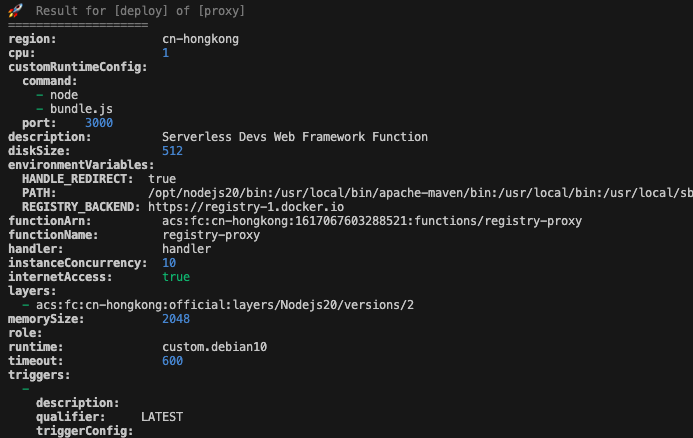
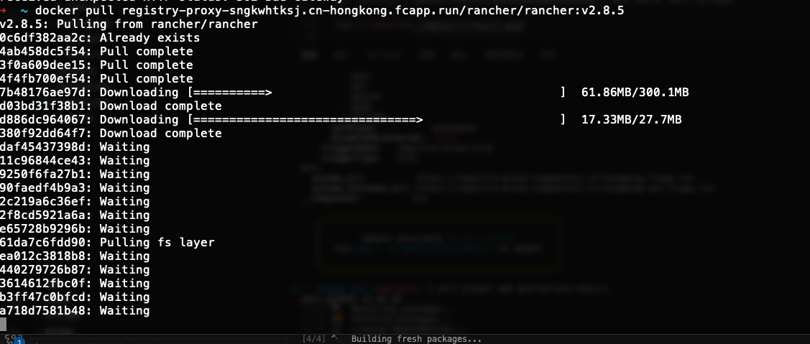

# registry-proxy-serverless

这个项目目标是使用 serverless 框架创建一个针对 docker registry 的代理服务，以加速访问主流的容器镜像仓库。

目前已经测试的云厂商情况如下：

- Aliyun cloud function, fc 3.0(✅)
- Tencent Cloud 云函数（❌，response size limit to 6MB）
- AWS Lambda(❌，response size limit to 1MB)
- Cloudflare(TODO)

## Before Run

以下是一下运行项目的必要条件：

如果需要部署到阿里云云函数，我们需要 serverless-devs cli 工具 `s`，安装方式参考：[https://serverless-devs.com/docs/user-guide/install]

- npm: `npm install @serverless-devs/s -g`
- yarn: `yarn global add @serverless-devs/s`

通过 `s config` 配置登陆密钥，根据提示输入 AccessKeyID，AccessKeySecret 与配置别名


> 部署前，请登陆 Aliyun UI，确保函数计算服务已经启用

本地 node 环境需要 >=20.x

## Run It

参数列表：

| 环境变量               | 参数说明                                                                                                                   |
| ---------------------- | -------------------------------------------------------------------------------------------------------------------------- |
| `REGISTRY_BACKEND`     | 远端 registry 地址                                                                                                         |
| `DEFAULT_BACKEND_HOST` | registry 的存储地址，默认与 `REGISTRY_BACKEND` 一致                                                                        |
| `PROXY_REDIRECT`       | 默认为 `true`，启用后 nginx 中 `proxy_redirect`作用相同，会将重定向到 `DEFAULT_BACKEND_HOST`的地址修改为本地的 server 地址 |
| `HANDLE_REDIRECT`      | 默认为 `false`，如启用时，遇到 3xx 请求时将由代理发起而不会返回到客户端进行处理                                            |
| `PORT`                 | http listen port                                                                                                           |

本地启动测试：

```bash
yarn install
yarn debug
```

部署到阿里云云函数：

```bash
cd deploy/aliyun
s deploy -a default
```

运行 `s deploy` 可以看到部署输出：



在部署的最下方，可以获取到 http trigger 的 url：

```console
...
url:
  system_url:          https://registry-proxy-sngkwhtksj.cn-hongkong.fcapp.run
  system_intranet_url: https://registry-proxy-sngkwhtksj.cn-hongkong-vpc.fcapp.run
...
```

这个 system_url 就是我们可以用来代理目标远端镜像仓库的地址了，使用 docker pull 进行测试，测试拉取速度还是比较可观的：



## How It Works

我们对 s.yaml 配置进行解读，完整的配置示例参考 [https://serverless-devs.com/docs/user-guide/spec]：

```yaml
edition: 3.0.0
name: proxy
vars:
  region: "cn-hongkong"
  functionName: "registry-proxy"
resources:
  start_express:
    component: fc3
    actions:
      pre-deploy:
        - run: export PATH=/usr/local/versions/node/v20.8.1/bin:$PATH && yarn install
          path: ../../
        - run: export PATH=/usr/local/versions/node/v20.8.1/bin:$PATH && yarn package:aliyun
          path: ../../
    props:
      region: ${vars.region}
      description: Serverless Devs Web Framework Function
      runtime: custom.debian10
      timeout: 600
      cpu: 1
      memorySize: 2048
      diskSize: 512
      instanceConcurrency: 10
      layers:
        - acs:fc:${vars.region}:official:layers/Nodejs20/versions/2
      environmentVariables:
        PATH: >-
          /opt/nodejs20/bin:/usr/local/bin/apache-maven/bin:/usr/local/bin:/usr/local/sbin:/usr/local/bin:/usr/sbin:/usr/bin:/sbin:/bin:/usr/local/ruby/bin
        HANDLE_REDIRECT: "true"
        REGISTRY_BACKEND: https://registry-1.docker.io
      customRuntimeConfig:
        command:
          - node
          - bundle.js
        port: 3000
      functionName: ${vars.functionName}
      code: ./dist
      triggers:
        - triggerConfig:
            methods:
              - GET
              - POST
              - PUT
              - DELETE
              - HEAD
              - OPTIONS
            authType: anonymous
            disableURLInternet: false
          triggerName: registry-proxy-http
          description: ""
          qualifier: LATEST
          triggerType: http
```

- 与本地部署相关的部分为 `actions` 配置段落，我们配置了在部署之前进行依赖安装以及构建目标的过程。
- 与运行环境相关的，有如下这些参数，如 `cpu`, `memorySize`（MB），`diskSize`(MB), `timeout`(秒)以及 `instanceConcurrency` 等，很直观的反映了其参数的作用
- 与运行时相关的参数，有基础运行时 `runtime: custom.debian10`，运行层 `layers`。这里我们使用更加通用的基础运行时 `debian10` 并叠加 `nodejs20` 这个官方的层，创建出 nodejs 20.x 的运行环境。
- 与代理工具函数相关的参数
  - `customRuntimeConfig.command` 固定为 `node bundle.js`，这里的 bundle.js 是 `yarn package:aliyun` 输出的单体 js 程序；端口默认配置为 `3000`。
  - 在环境变量 `environmentVariables` 中，有几个关键配置
    - `REGISTRY_BACKEND` 我们使用 `https://registry-1.docker.io` 作为例子，函数中会代理 `/v2/*` 请求到这个地址中。
    - `HANDLE_REDIRECT` 我们配置为 `true`，由于不确定 docker.io 会将我们的请求重定向到哪个 cdn，我们直接让函数帮我们完成重定向。
- 触发器相关配置 `triggers`，示例中启用了 `triggerType: http` 类型的触发器，启动后就会由 aliyun 提供一个测试域名给到我们进行访问，后续也可以在阿里云控制台中配置自定义域名。

与之对应的 nginx 配置存放在 [./docs/nginx.conf](./docs/nginx.conf)，可以进行参考使用。

## Why doing this?

docker registry 带有 [pull through cache](https://docs.docker.com/docker-hub/image-library/mirror/#solution) 的功能，那为什么要引入 serverless 呢？  
这里就涉及到一个成本的问题，以下是一个方案对比：

|            | 优势                           | 劣势                                             |
| ---------- | ------------------------------ | ------------------------------------------------ |
| registry   | 配置简单，能 cache 在磁盘      | 需要一台云主机长时间运行，需要占用一定的磁盘空间 |
| serverless | 启动速度快，按需使用，成本低廉 | 需要一定的学习门槛                               |

理想的架构如下：


Serverless 现在的热度是比较低的，网上关于 serverless 的资料大部分都是 1 年前的，更多的都是在各自云厂商的社区里面进行迭代，这个也是 serverless 目前的属性，跟云厂商的耦合度较高，这次测试下来各个厂商都有自己的使用限制。各种工具都只在特定的云厂商中支持，无法做到像容器镜像一样 build once, run everywhere 的场景。  
但是在特定的场景下，serverless 还是很好用的，按需收费的场景，能大大减少低频服务的使用成本，另外在首次开通阿里云云函数的功能，还有机会获取一年的试用资源包，这个还是很不错的。
