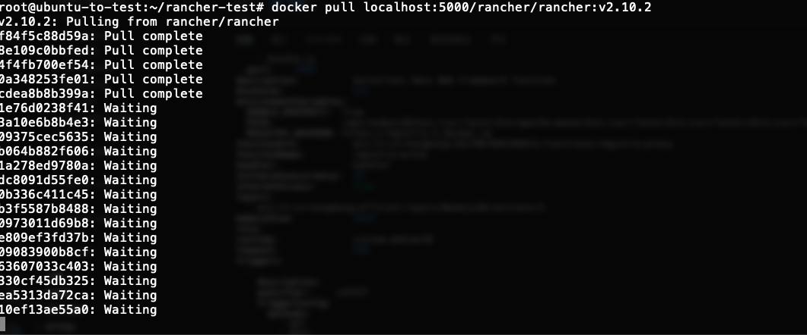
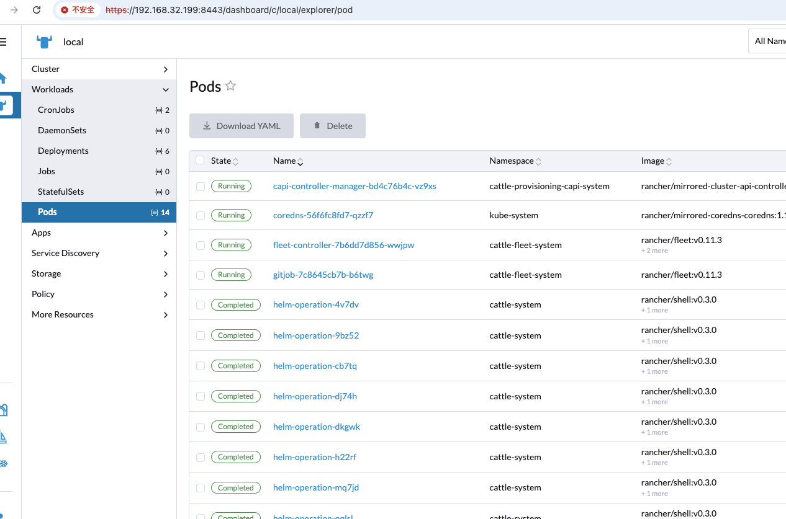
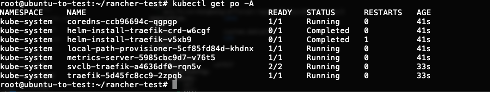
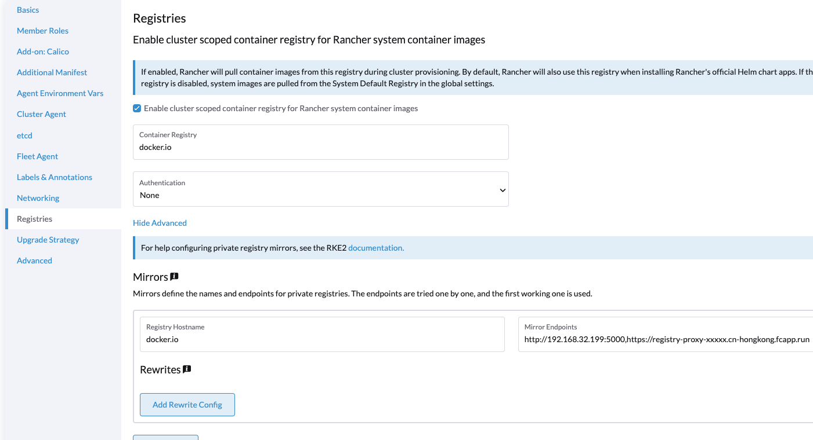

# 使用镜像加速快速启动 Rancher

由于在国内访问主流的容器镜像仓库多多少少都会遇到问题，在启动 Rancher 时，都会因为这个原因，导致启动失败，这次就结合 docker registry，阿里云函数计算，搭建一个可复用的快速启动 Rancher 方案。

## 前期准备

本次分享涉及到以下内容

- 搭建低成本的加速服务
- 搭建近端的镜像缓存(_可选_)
- 使用加速仓库/本地镜像缓存启动 Rancher
- 使用加速仓库/本地镜像缓存启动 K3s

## 加速服务与仓库搭建

我们本次使用低成本的 serverless 服务作为我们加速服务的方案，参考项目 [registry-proxy-serverless](https://github.com/orangedeng/registry-proxy-serverless)。

根据项目配置，在阿里云上搭建了一个 dockerhub 的代理服务，加速镜像拉取

```bash
node -v # 确保 node 版本 >= 20

# 安装 serverless-devs cli工具 s
npm install @serverless-devs/s -g
# yarn global add @serverless-devs/s

# 配置阿里云 ak/sk，参考 https://serverless-devs.com/docs/user-guide/config
s config add -a default --AccessKeyID ****** --AccessKeySecret ****** -f
# 克隆本项目
git clone https://github.com/orangedeng/registry-proxy-serverless
cd registry-proxy-serverless/deploy/aliyun
# 这里假设已经完成了 s config add 配置，并配置密钥别名为 default
s deploy -a default
```

运行 `s deploy` 可以看到部署输出：


在部署的最下方，可以获取到 http trigger 的 url：

```console
...
url:
  system_url:          https://registry-proxy-xxxxx.cn-hongkong.fcapp.run
  system_intranet_url: https://registry-proxy-xxxxx.cn-hongkong-vpc.fcapp.run
...
```

接着我们来部署本近端的 registry 作为镜像缓存使用，生成以下配置：

```yaml
version: 0.1
storage:
  cache:
    blobdescriptor: inmemory
  filesystem:
    rootdirectory: /var/lib/registry
http:
  addr: :5000
  headers:
    X-Content-Type-Options: [nosniff]
proxy:
  remoteurl: https://registry-proxy-xxxxx.cn-hongkong.fcapp.run
```

在 `proxy.remoteurl` 的配置中，输入阿里云函数获取的 `url.system_url` 的值，例子中为： `https://registry-proxy-xxxxx.cn-hongkong.fcapp.run`

假定配置在当前目录，使用 `registry:2` 启动本地的 pull through cache：

```bash
docker run -d -p 5000:5000 \
-v ${PWD}/config.yml:/etc/docker/registry/config.yml \
-v ${PWD}/registry:/var/lib/registry --name registry-cache registry:2
```

测试拉取 rancher v2.9.5 版本镜像，拉取成功：


到这里我们就创建了一个本地缓存，云端加速的镜像仓库服务了。

## Docker Run Rancher

在快速启动的场景，Docker run 方式是不二之选，但是由于 Rancher 内部会启动一个 k3s 作为管理集群，此时会遇到一些系统镜像无法拉取的情况，这时候就是我们加速服务与缓存仓库发挥作用时候。

> Docker run 方式并不适合生产使用，生产环境请选择更可靠的方式部署 Rancher

使用缓存仓库配置 registries.yaml，参考 [k3s 文档](https://docs.k3s.io/zh/installation/registry-mirror?_highlight=registries#enabling-registry-mirroring):

```yaml
mirrors:
  docker.io:
    endpoint:
      - "http://192.168.32.199:5000"
      # 如果不需要使用本地缓存，则只做以下的配置，此处配置使用serverless返回的 url.system_url 地址：
      - "https://registry-proxy-xxxxx.cn-hongkong.fcapp.run"
```

拉取 v2.10.2 Rancher 镜像：



假设 registries.yaml 配置存放在当前路径，使用以下命令启动 Rancher：

```bash
docker run -d -p 8080:80 -p 8443:443 \
--privileged --name rancher \
-v ${PWD}/registries.yaml:/etc/rancher/k3s/registries.yaml \
localhost:5000/rancher/rancher:v2.10.2
```

登陆 Rancher UI 后，看到 local 集群中所有的 pod 都正常启动，没有发生镜像拉取失败的情况



## K3s

使用与启动 Rancher 相同的 registries.yaml，保存到 `/etc/rancher/k3s/registries.yaml`

```yaml
mirrors:
  docker.io:
    endpoint:
      - "http://192.168.32.199:5000"
      # 如果不需要使用本地缓存，则只做以下的配置，此处配置使用serverless返回的 url.system_url 地址：
      - "https://registry-proxy-xxxxx.cn-hongkong.fcapp.run"
```

使用命令安装 k3s 并启动：

```bash
mkdir -p /etc/rancher/k3s
cp registries.yaml /etc/rancher/k3s/
curl -sfL https://rancher-mirror.rancher.cn/k3s/k3s-install.sh | INSTALL_K3S_MIRROR=cn INSTALL_K3S_VERSION=v1.31.5+k3s1 sh -
```

稍等一段时间后，系统组件启动成功，没有出现镜像拉取失败的情况：



如果希望在自定义集群使用，可参考如下配置：



## 总结

通过近端镜像缓存 + 远端代理加速，可以有效的解决由于镜像仓库无法访问或访问缓慢导致的 Rancher 启动失败，集群安装失败的问题。  
使用 serverless，可有效减少服务器费用，对于低频次使用的服务能力来说是一个不错的选择。  
使用近端镜像缓存，可加速本地环境镜像下载，减少远端服务使用时间，降低成本，提高可靠性。
