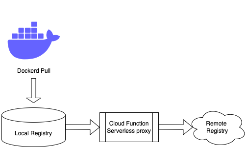
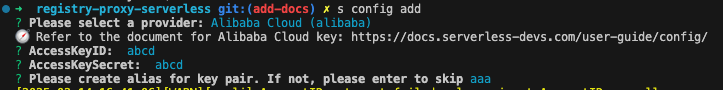
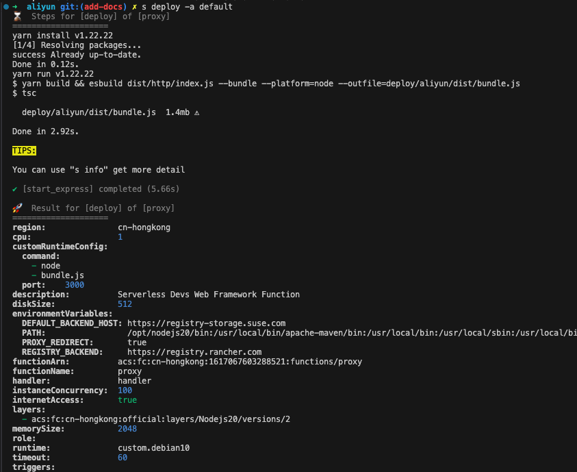
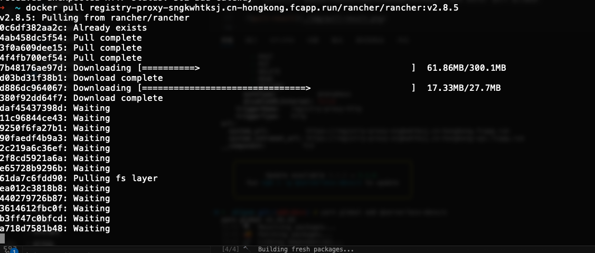
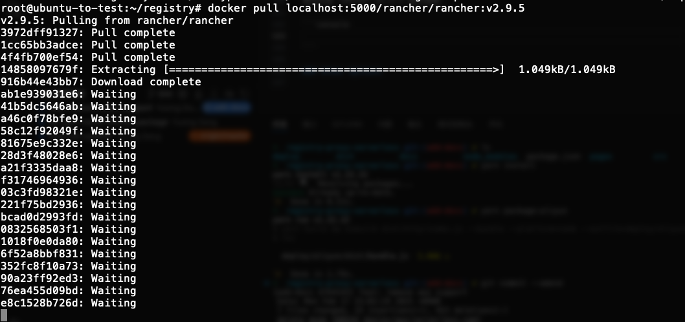

# Docker registry 高性价比搭建方案

## 背景

最近在本地的测试过程中，遇到了 registry.rancher.com 访问缓慢的问题，在排查了一路之后，发现还是网络带来的问题，决定结合 serverless 给大家分享我正在使用的镜像仓库加速方案。  
由于各种原因，国内很多主流的镜像仓库都无法使用，其他用爱发电的项目搭建起来也不稳定，最好的选择还是掌握自己搭建的技术，随时备份方案，减少被网络环境的问题导致浪费大量的时间。

参考工具与项目：

| 项目名称                  | 介绍                                                                                                   |
| ------------------------- | ------------------------------------------------------------------------------------------------------ |
| serverless-devs.com       | 阿里云与火山引擎主导的 serverless 项目                                                                 |
| docker registry           | docker 容器镜像仓库项目 [https://github.com/distribution/distribution]                                 |
| registry proxy serverless | 使用 nodejs 编写的，轻量简单的 registry 代理 [https://github.com/orangedeng/registry-proxy-serverless] |

到这里可能各位读者会有个疑问，docker registry 带有 [pull through cache](https://docs.docker.com/docker-hub/image-library/mirror/#solution) 的功能，那为什么要引入 serverless 呢？  
这里就涉及到一个成本的问题，以下是一个方案对比：

|            | 优势                           | 劣势                                             |
| ---------- | ------------------------------ | ------------------------------------------------ |
| registry   | 配置简单，能 cache 在磁盘      | 需要一台云主机长时间运行，需要占用一定的磁盘空间 |
| serverless | 启动速度快，按需使用，成本低廉 | 需要一定的学习门槛                               |

两者都各有千秋，所以我们结合两个方案，打造一个既兼顾成本，又能提高镜像拉取速度的方案。

## Let's Build Together

期望的架构图如下：



- 在本地资源有空余的情况下，我们使用近端的 registry，充当本地的镜像仓库缓存，这样在如部署多个节点的 k8s 集群场景下，可以通过近端的 cache，提供快速拉取的服务
- Cloud Function 这里提供的是加速代理的作用，解决近端 registry 无法访问或访问 Remote Registry 缓慢问题

### Cloud Function

这里我们以 Aliyun（阿里云函数计算 3.0） 为例，经测试 Tencent Cloud 在 response 上有 6MB 的内容限制，AWS Lambda 则是 1MB 的 response 返回限制。

如果需要部署到阿里云云函数，我们需要 serverless-devs cli 工具 `s`，安装方式参考：[https://serverless-devs.com/docs/user-guide/install]

- npm:
  `npm install @serverless-devs/s -g`
- yarn:
  `yarn global add @serverless-devs/s`

通过 `s config` 配置登陆密钥，根据提示输入 AccessKeyID，AccessKeySecret 与配置别名



> 部署前，请登陆 Aliyun UI，确保函数计算服务已经启用

```bash
node -v # 确保 node 版本 >= 20
# 克隆本项目
git clone https://github.com/orangedeng/registry-proxy-serverless
cd registry-proxy-serverless/deploy/aliyun
# 这里假设已经完成了 s config add 配置，并配置密钥别名为 default
s deploy -a default
```

运行 `s deploy` 可以看到部署输出：



在部署的最下方，可以获取到 http trigger 的 url：

```console
...
url:
  system_url:          https://registry-proxy-sngkwhtksj.cn-hongkong.fcapp.run
  system_intranet_url: https://registry-proxy-sngkwhtksj.cn-hongkong-vpc.fcapp.run
...
```

这个 system_url 就是我们可以用来代理目标远端镜像仓库的地址了，使用 docker pull 进行测试，测试拉取速度还是比较客观的：



我们对 s.yaml 配置进行解读，完整的配置示例参考 [https://serverless-devs.com/docs/user-guide/spec]：

```yaml
edition: 3.0.0
name: proxy
vars:
  region: "cn-hongkong"
  functionName: "registry-proxy"
resources:
  start_express:
    component: fc3
    actions:
      pre-deploy:
        - run: export PATH=/usr/local/versions/node/v20.8.1/bin:$PATH && yarn install
          path: ../../
        - run: export PATH=/usr/local/versions/node/v20.8.1/bin:$PATH && yarn package:aliyun
          path: ../../
    props:
      region: ${vars.region}
      description: Serverless Devs Web Framework Function
      runtime: custom.debian10
      timeout: 600
      cpu: 1
      memorySize: 2048
      diskSize: 512
      instanceConcurrency: 10
      layers:
        - acs:fc:${vars.region}:official:layers/Nodejs20/versions/2
      environmentVariables:
        PATH: >-
          /opt/nodejs20/bin:/usr/local/bin/apache-maven/bin:/usr/local/bin:/usr/local/sbin:/usr/local/bin:/usr/sbin:/usr/bin:/sbin:/bin:/usr/local/ruby/bin
        DEFAULT_BACKEND_HOST: https://registry-storage.suse.com
        PROXY_REDIRECT: "true"
        REGISTRY_BACKEND: https://registry.rancher.com
      customRuntimeConfig:
        command:
          - node
          - bundle.js
        port: 3000
      functionName: ${vars.functionName}
      code: ./dist
      triggers:
        - triggerConfig:
            methods:
              - GET
              - POST
              - PUT
              - DELETE
              - HEAD
              - OPTIONS
            authType: anonymous
            disableURLInternet: false
          triggerName: registry-proxy-http
          description: ""
          qualifier: LATEST
          triggerType: http
```

- 与本地部署相关的部分为 `actions` 配置段落，我们配置了在部署之前进行依赖安装以及构建目标的过程。
- 与运行环境相关的，有如下这些参数，如 `cpu`, `memorySize`（MB），`diskSize`(MB), `timeout`(秒)以及 `instanceConcurrency` 等，很直观的反映了其参数的作用
- 与运行时相关的参数，有基础运行时 `runtime: custom.debian10`，运行层 `layers`。这里我们使用更加通用的基础运行时 `debian10` 并叠加 `nodejs20` 这个官方的层，创建出 nodejs 20.x 的运行环境。
- 与代理工具函数相关的参数
  - `customRuntimeConfig.command` 固定为 `node bundle.js`，这里的 bundle.js 是 `yarn package:aliyun` 输出的单体 js 程序；端口默认配置为 `3000`。
  - 在环境变量 `environmentVariables` 中，有几个关键配置
    - `REGISTRY_BACKEND` 这个配置为 registry 前端的服务地址，主要是处理镜像仓库的主要 API 服务 `/v2/*`。
    - `DEFAULT_BACKEND_HOST` 这个配置为 registry 后端存储服务的地址，需要根据远端 registry 实际情况进行配置，常用的后端存储如 s3/gcs/azure。
    - `PROXY_REDIRECT` 默认配置为 `true`，启用时会对 registry 返回的 3xx 请求做重定向，将 `DEFAULT_BACKEND_HOST` 修改为当前服务的地址，与 nginx `proxy_redirect` 效果类似。
    - `HANDLE_REDIRECT` 默认配置为 `false`，在当前例子中没有启用，启用时将不会再进行 3xx 的重定向，而是会在函数内部请求重定向内容后返回给客户端，这样能避免阿里云函数中，如果重定向的 path 长度超过 4096 会被拦截的问题。
- 触发器相关配置 `triggers`，示例中启用了 `triggerType: http` 类型的触发器，启动后就会由 aliyun 提供一个测试域名给到我们进行访问，后续也可以在阿里云控制台中配置自定义域名。

在这个例子中我们以 Rancher Prime 下载地址 `https://registry.rancher.com` 与存储后端 `https://registry-storage.suse.com` 为例进行配置。其他配置例子如：

- dockerhub: `REGISTRY_BACKEND: https://registry-1.docker.io` 与 `HANDLE_REDIRECT: 'true'`

到这里我们就完成了云函数中的配置，基本解决了可达性的问题。

### Registry Pull Through Cache

创建 registry 配置：

```yaml
version: 0.1
storage:
  cache:
    blobdescriptor: inmemory
  filesystem:
    rootdirectory: /var/lib/registry
http:
  addr: :5000
  headers:
    X-Content-Type-Options: [nosniff]
proxy:
  remoteurl: https://registry-proxy-sngkwhtksj.cn-hongkong.fcapp.run
```

假定配置在当前目录，使用 `registry:2` 启动本地的 pull through cache：

```bash
docker run -d -p 5000:5000 -v ${PWD}/config.yml:/etc/docker/registry/config.yml -v ${PWD}/registry:/var/lib/registry --name registry-cache registry:2
```

测试拉取 rancher v2.9.5 版本镜像，拉取成功：



到这里我们就完成了近端缓存+远端加速的方案搭建。

### Other Options

1. 使用 nginx 代替 serverless function，这里有两个思路

   - 使用 serverless 中容器功能启动 nginx，在几个不同的云平台上，基本都只能使用对应平台的镜像仓库拉取镜像，配置也无法便捷的下发到容器中
   - 使用独立的服务器运行 nginx，这样就回到了本文一开始的 serverless 与 registry 对比的表格中，还不如直接在服务器运行 registry
   - 示例 nginx 配置：

     ```config
      server {
      listen 80;
      resolver 114.114.114.114 8.8.8.8 valid=30s;
      location /v2/ {
          proxy_pass https://registry.rancher.com;
          proxy_set_header Host registry.rancher.com;
          proxy_set_header X-Real-IP $remote_addr;
          proxy_set_header X-Forwarded-For $proxy_add_x_forwarded_for;
          proxy_set_header X-Forwarded-Proto $scheme;

          proxy_redirect https://registry-storage.suse.com http://$host;
          proxy_intercept_errors on;
          error_page 301 302 307 = @handle_redirect;
      }

      location @handle_redirect {
          set $saved_redirect_location '$upstream_http_location';
          proxy_pass $saved_redirect_location;
          proxy_ssl_server_name on;
          proxy_ssl_session_reuse off;
          proxy_set_header Host registry-storage.suse.com;
          proxy_set_header X-Real-IP $remote_addr;
          proxy_set_header X-Forwarded-For $proxy_add_x_forwarded_for;
          proxy_set_header X-Forwarded-Proto $scheme;
      }

      location / {
          proxy_pass https://registry-storage.suse.com;
          proxy_ssl_server_name on;
          proxy_ssl_session_reuse off;
          proxy_set_header Host registry-storage.suse.com;
          proxy_set_header X-Real-IP $remote_addr;
          proxy_set_header X-Forwarded-For $proxy_add_x_forwarded_for;
          proxy_set_header X-Forwarded-Proto $scheme;
       }
      }
     ```

2. 为什么使用 Harbor 代替 registry 作为近端缓存的选择？
   - Harbor 能提供多种能力，比如独立于远端 registry 的 auth，p2p 镜像分发，本地 registry 与 Pull through cache 结合等能力，实际可以按照需要选择使用 harbor 的。
   - 在使用 Harbor 作为 pull through cache（harbor 中叫做 proxy cache） 时，这个功能只能在一个 Harbor 项目中使用，在拉取目标镜像时，会从 `<registry-name>/<image-name-with-repo>` 变成 `<harbor-name>/<project-name>/<image-name-with-repo>`，在大部分场景下都需要做额外处理，带来额外的配置负担。
3. 对于 CDN 的使用
   - 在有限的场景下，可以在这个方案上叠加 CDN，但是由于近端 registry pull through cache 的存在，在代理函数的外层配置 CDN 的意义就不是特别大
   - 同时我们并没有对远端 remote registry 的认证做任何调整，同时无法准确识别到私有仓库的情况，在考虑到需要规避越权拉取镜像的情况，配置 CDN 的难度就很大
   - 如果对存储后端 `DEFAULT_BACKEND_HOST` 的地址做 CDN 是否可行呢？其实效果会不明显，在现在 registry 支持的 storage 列表中，大部分在返回数据链接都是临时链接，只有短期有效，即使配置了 CDN，大部分情况下 CDN 的 link 都不会被匹配到

## 总结

Serverless 现在的热度是比较低的，网上关于 serverless 的资料大部分都是 1 年前的，更多的都是在各自云厂商的社区里面进行迭代，这个也是 serverless 目前的属性，跟云厂商的耦合度较高，这次测试下来各个厂商都有自己的使用限制。各种工具都只在特定的云厂商中支持，无法做到像容器镜像一样 build once, run everywhere 的场景。  
但是在特定的场景下，serverless 还是很好用的，按需收费的场景，能大大减少低频服务的使用成本，另外在首次开通阿里云云函数的功能，还有机会获取一年的试用资源包，这个还是很不错的。  
总的来说，如果你的团队不在乎成本，那我觉得这篇文章对你来说毫无用处。但如果你需要一个低成本使用频率低的服务，那精明的读者们一定不会错过这种降低成本方案。
